# The pages in the project

## Table of contents

1. Password reset
2. Logins
3. Home
4. View trailer
5. Editor home
6. Editor series
7. Editor manage media

### Password reset
I've implemented password reset functionallity with the auth views from django. (See more info [Here](password.md))

The pages which makes this possible includes:

* password_reset_complete
* password_reset_confirm
* password_reset_done
* password_reset_email
* password_reset_form

All pages are found in `accounts\templates\registration`

I've included some screenshoots from the pages here:

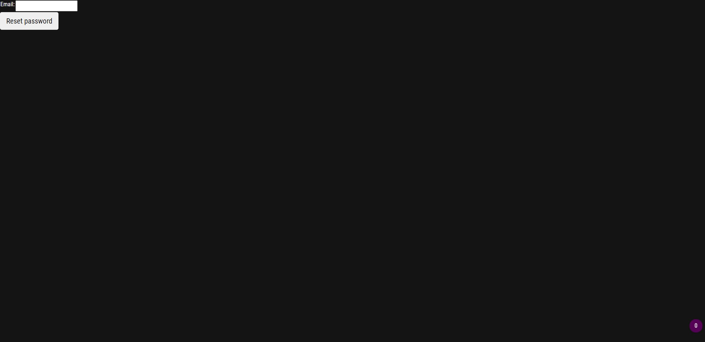
**password_reset_form**
Here you enter your email for the account

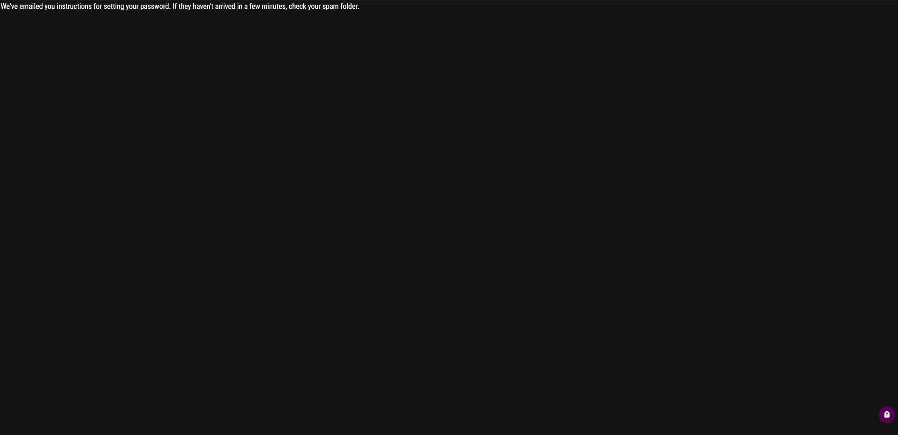
**password_reset_done**
The email with the reset link is sent.
We don't actually send the email any where but store it on the disk in the folder `sent_emails`

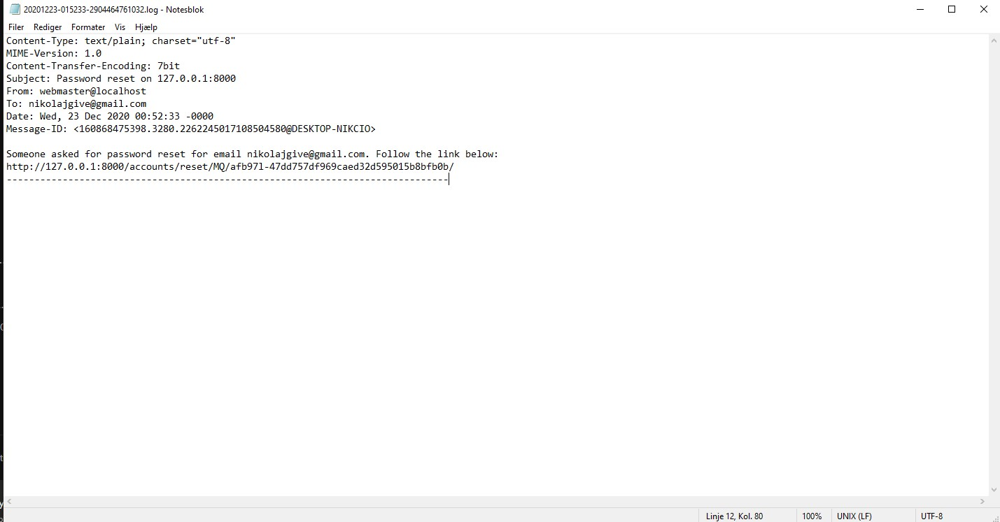
**password_reset_email**
Here is an example on what the email could look like

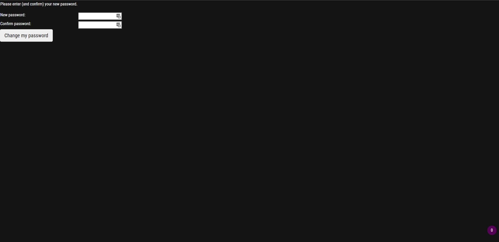
**password_reset_confirm**
The user can their new password

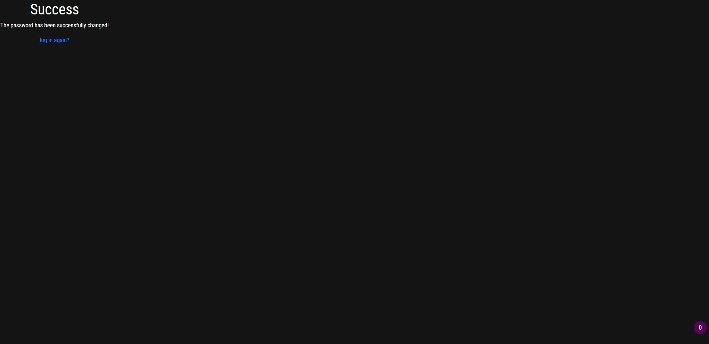
**password_reset_complete**
The process is complete and the user can now login again with the new password

### Logins
I've made two different login pages. One for the standard user and one for an editor user. (See more info [Here](login.md))

The two pages are:

* login
* EditorLogin

All pages are found in `accounts\templates\registration`

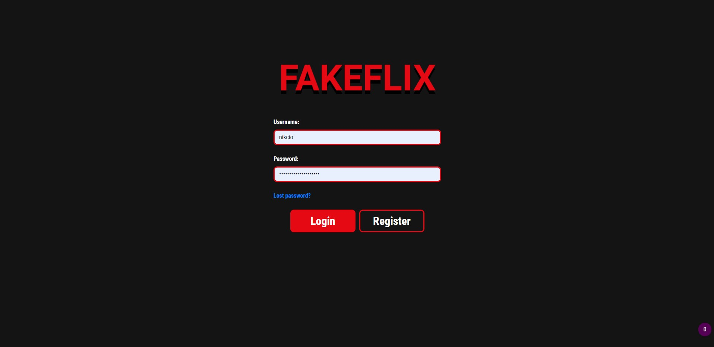
**login**
Here the standard user can login

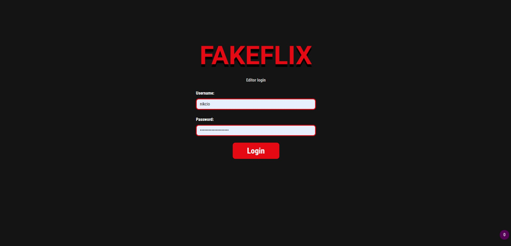
**EditorLogin**
Here an editor can login

I've also created a registraion page for standard users:

* signup
  
The page can be found in `accounts\templates\registration`

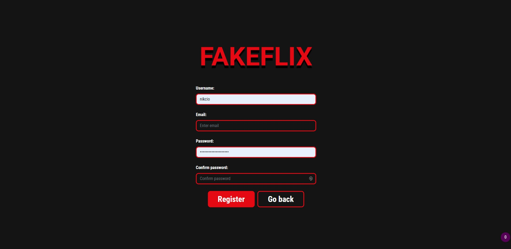
**signup**
Here a user can signup

### Home
I've made a home page to show movies. This template also shows series and the media the user has saved.

* Home

The page can be found in `webapp\templates\webapp`

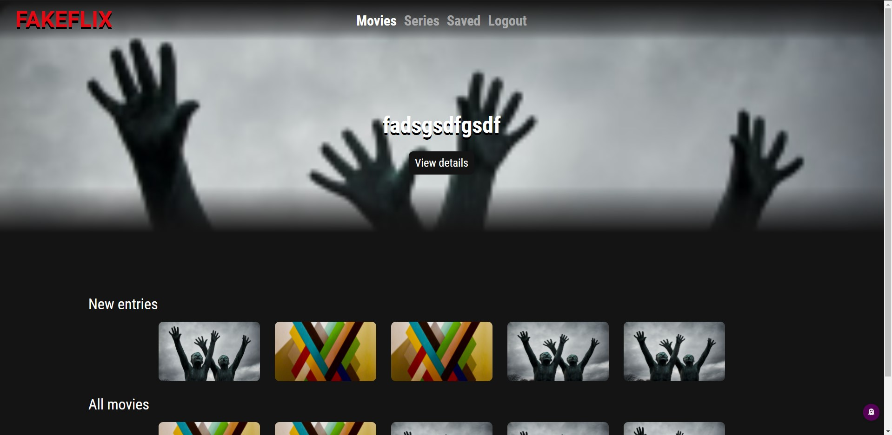
**Home**
Here the user can see which movies/series are accessible/saved.

The page also allows the user to see the information about the media item:

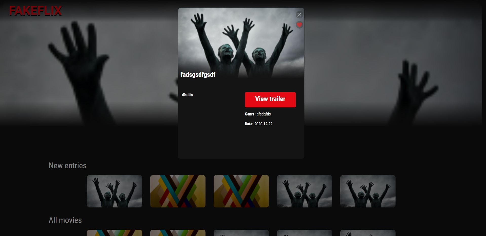
by clicking an item a modal is shown with the information about the media item.

### View trailer
I've made a trailer page to show the trailer the movie/series has.

* ViewTrailer

The page can be found in `webapp\templates\webapp`

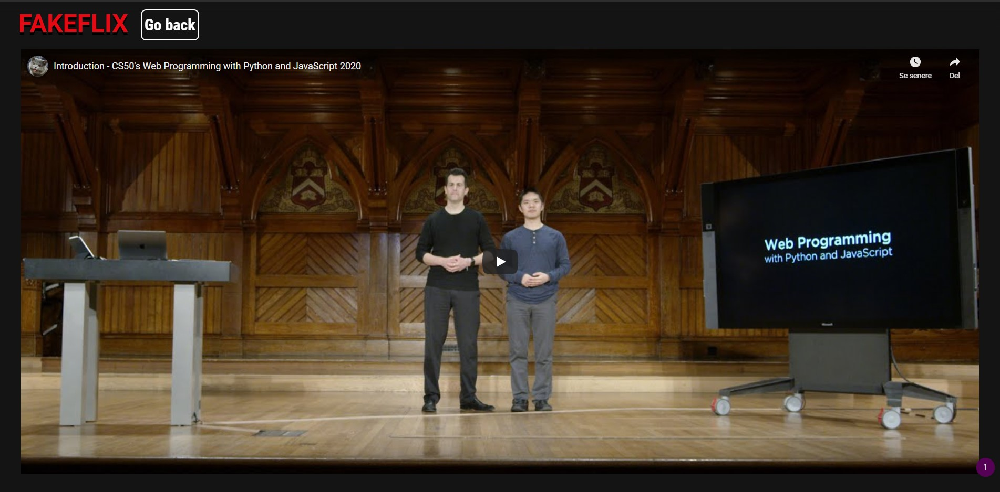
**ViewTrailer**
Here the user can see a trailer to a movie

### Editor home
I've made a editor home page to show movies aswell as making it possible to add and edit info.

* EditorHome

The page can be found in `webapp\templates\webapp`

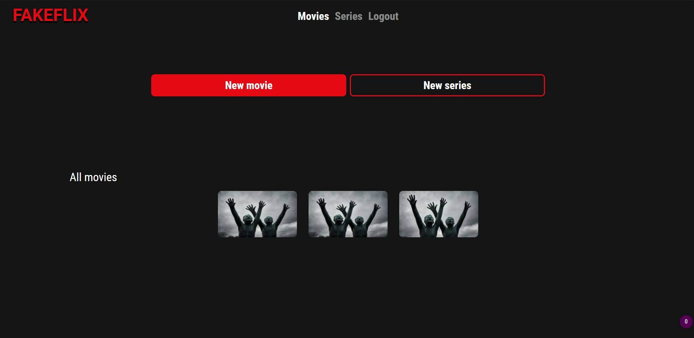
**EditorHome**
Here the user can see which movies/series are accessible and edit or add items.

### Editor series
I've made a editor home page to show series aswell as making it possible to add and edit info.

* EditorSeries

The page can be found in `webapp\templates\webapp`

The layout is almost identical to the Editor home.

### Editor manage media
I've made some pages to manage media these allow an editor to create update and delete a media item.

Pages used:

* EditorNewMovie
* EditorNewSeries
* EditorEditMovie
* EditorEditSeries

The pages can be found in `webapp\templates\webapp`

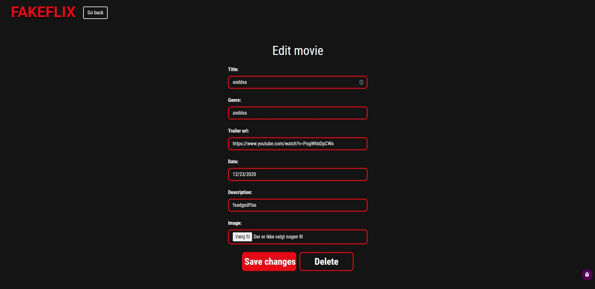
**EditorEditMovie**
All views are created in the same manner. (Some form and buttons at the bottom)
Here the user can edit the information about a movie or delete the movie.